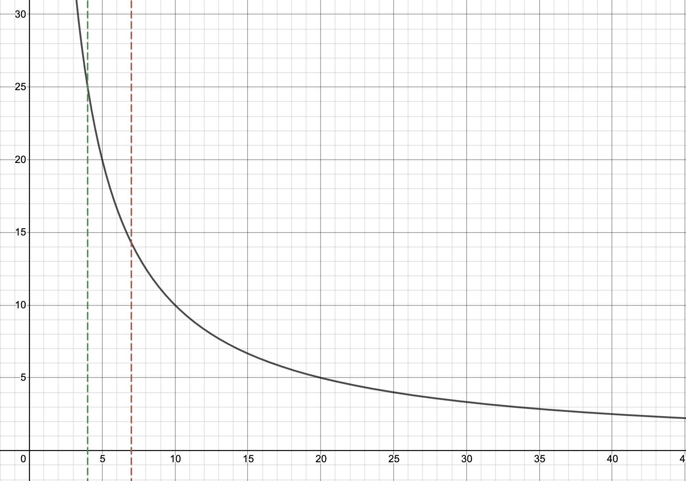

Un bon moyen de calculer votre "chiffre magique", c'est-à-dire le moment où vous pouvez vous permettre de quitter votre boulot et vous consacrer à ce qui vous intéresse dans la vie, c'est d'utiliser la règle des 4%.

J'irai jusqu'à dire que la règle des 4% est le fondement de la communauté FIRE (indépendance financière et retraite anticipé). Elle stipule que si vous économisez vingt-cinq fois votre dépense annuelle vous pourrez vivre indéfiniment des intérêts générés par vos investissement. Indéfiniment signifie que à partir de ce moment-là, votre revenu passif dépasse vos dépenses annuelles et vous ne devriez plus avoir besoin de toucher à votre capital.

Essayons maintenant de voir sur quoi ce base cette règle.

Le but de l'indépendance financière est de pouvoir vivre grâce au revenus passif :

`dépense annuelle = rendement investissement * économies`

Exprimons maintenant les économies comme un facteur `N` des dépenses annuels :

`économies = n * dépense annuel`

Donc notre initial formule devient :

`dépense annuelle = rendement investissement * N * dépense annuel`

Donc, `N = 1 / rendement investissement`

Prenons maintenant un exemple, si l'on utilise 4% pour le rendement des investissements on obtient `N = 1/4% = 25`. Tout devient clair ! Cette formule donne le nombre de fois qu'il faut économiser votre dépense annuelle en fonction du rendement de vos investissement.

Traçons maintenant la courbe de cette formule.

Sur cette courbe, vous avez en ordonné N, le facteur des dépenses annuels et en abscisses le rendement des investissements. Les pointilles verts représente la règle des 4%. Vous pouvez voir que l'intersection entre la courbe et les pointilles vert se fait à N=25.

J'ai aussi ajouté une deuxième ligne en pointillé rouge. Celle-là se base sur 7% de rendement de vos investissements. Comme vous pouvez le voir, celle-ci croise la courbe environ à 14 !

Ce qui veut dire que si vous parvenez à un rendement de 7% sur vos investissements, il vous faudra économiser non pas 25 fois vos dépenses annuels mais 14 fois !

Pour finir, faisons un tableau de combien vous aurez besoin d'économiser en fonction de vos dépenses mensuelles et du rendement de vos investissement.

   Dépense annuelle      | rendement 4%         | rendement 7%
 :- | :- | :-
 1,000 | 300,000   | 171,000
 1,500 | 450,000  | 257,000
 2,000 | 600,000 | 343,000
 2,500 | 750,000 | 429,000
 3,000 | 900,000 | 514,000
 3,500 | 1,050,000 | 600,000

Nous n'avons pas abordé l'inflation, ce sera un sujet pour un autre article. Mais sachez que lorsque vous calculez le rendement de vos investissements vous devez y soustraire l'inflation. La plupart des gouvernements se base sur 2% d'inflation annuels. En réalité actuellement il y a très peu d'inflation en Europe, mais pour être prudent, votre rendement brut doit donc être de 6% et non pas 4%.
