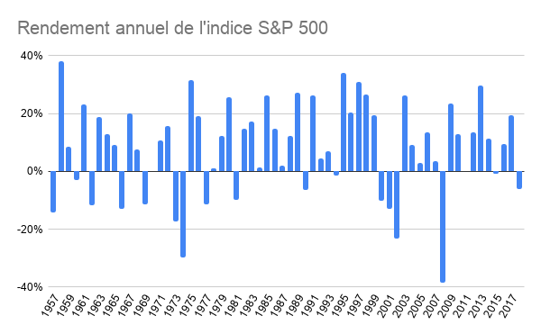

Pour faire fructifier vos économies vous avez plusieurs options dont investir en actions / index, investissement locatif, investissement en crypto-monnaies, investissement en minerais, etc.. L'un des plus important facteur de comparaison est bien évidement le rendement annuel.

Pour analyser le rendement historique de l'investissement en actions / index, le plus pertinent est d'étudier le S&P 500.
C'est un indice d'une capitalisation colossale de plus de 31 billions, qui suit les 500 plus grandes entreprise Américaine. Il existe depuis 1926, mais à l'époque il n'était composé que de 90 entreprise, ce n'est qu'en 1957 qu'il est passé à 500 entreprise.

**Le rendement annuel du S&P 500 sur les derniers 60 années a été de 8%.**

Traduisons celà en terme d'intérêts cumulés. Si quelqu'un avait investit 1,000€ chaque années dans S&P 500 depuis les dernières 60 années il aurait maintenant 1,253,213€ comparé à simplement 60,000€ s'il n'avait rien investit.

